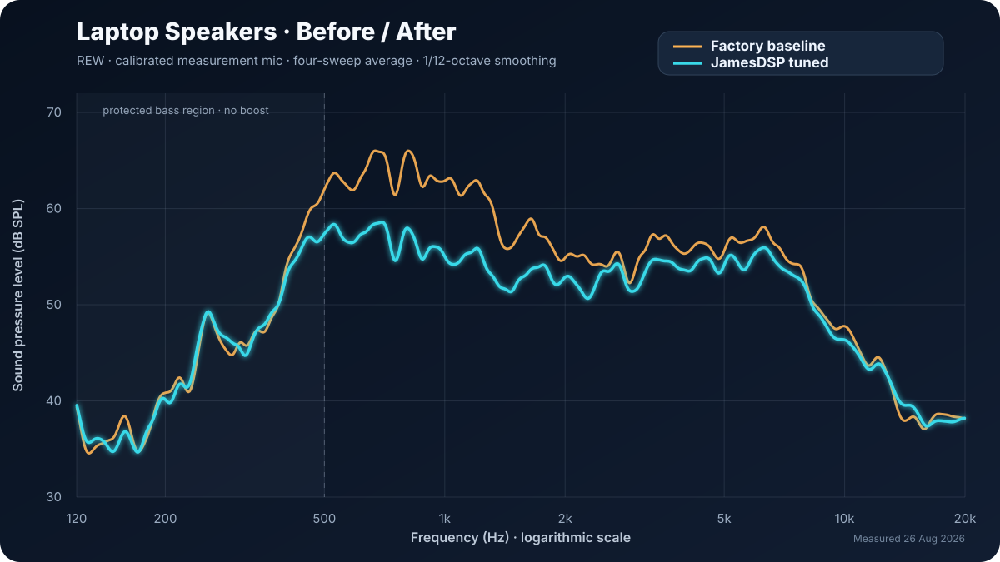

# Audio Calibration MCP

<p align="center">
  
</p>

Audio Calibration MCP is a local-first, cross-platform Model Context Protocol
server for Room EQ Wizard (REW). It guides acoustic measurement, speaker and
room calibration, subwoofer and crossover analysis, conservative EQ, DSP
deployment, and measured verification for general, powered-speaker, car, and
laptop audio systems.

This project does not promise universally “perfect” sound. REW can measure an
acoustic system; it cannot infer listener preference, microphone placement, or a
speaker's safe output capability without evidence. The MCP reports missing data
and keeps preference separate from engineering calculations.

[](https://github.com/daredoole/audio-calibration-mcp/actions/workflows/ci.yml)
[](https://github.com/daredoole/audio-calibration-mcp/actions/workflows/codeql.yml)
[](https://github.com/daredoole/audio-calibration-mcp/releases)
[](LICENSE)
[](https://buymeacoffee.com/daredoole)

## Choose the right audio MCP

| Use this project when you need | Use [EvoBurrow MCP](https://github.com/daredoole/evoburrow-mcp) when you need |
|---|---|
| General REW acoustic measurement and evidence-based EQ | A1 Evo AcoustiX artifact inspection or terminal workflows |
| Room, speaker, subwoofer, car, powered-speaker, or laptop calibration | Denon/Marantz AVR status, preset mapping, backup, or guarded LAN control |
| JamesDSP, CamillaDSP, Equalizer APO, FIR, or listening-test workflows | Audyssey `.ady`/`.oca` review tied to live receiver state |

The projects share measurement discipline, but this MCP deliberately stays hardware-neutral; EvoBurrow owns the A1 and AVR-specific safety boundary.

## Measured laptop example — before and after



This is measured evidence from four repeated REW sweeps per state, averaged with
1/12-octave smoothing. Factory is amber and the cut-only JamesDSP preset is cyan.
The shaded area below 500 Hz marks the protection-limited bass region where no
boost was applied. The plot preserves measured SPL; preference was assessed in a
separate level-matched listening comparison. Device, microphone, and preset
identifiers are intentionally removed from the public artifact.

## Compatibility

| Component | Support |
|---|---|
| Node.js | 20 and 22 |
| Operating systems | Windows x64, macOS Intel/Apple Silicon, Linux x64/ARM64 |
| REW | Local API on port 4735; cross-platform install discovery and confirmed startup |
| JamesDSP | Linux/JDSP4Linux inspect, preview, backup, apply, verify, rollback, blinded level-matched A/B |
| Equalizer APO | Export; guarded apply when an explicit config path is configured |
| CamillaDSP | YAML export; guarded file apply when explicitly configured |
| miniDSP | REW-compatible text export; no hardware mutation in the beta |
| A1 Evo/Denon | Optional separate bridge; no AVR assumptions in this plugin |

## Install

Download a GitHub release archive and point Codex at its `.mcp.json`. For a source
checkout:

```text
npm ci --ignore-scripts
npm test
npm run validate:release
```

The checked-in MCP configuration starts the self-contained `dist/server.mjs`.
The packaged CLI is also bundled, and the published artifact declares zero
runtime npm dependencies. Third-party build inputs are exact-pinned and installed
with lifecycle scripts disabled. Run
`rew_install_discover` to locate REW through a user override, the
`AUDIO_REW_EXECUTABLE` environment variable, `PATH`, and conventional Windows,
macOS, or Linux locations. If discovery fails, pass the absolute executable path
(or `REW.app` on macOS) to that tool or `rew_launch_plan`. Starting REW requires
the matching `rew_launch_execute` confirmation. Startup is verified against the
API on `http://127.0.0.1:4735`; override `AUDIO_REW_URL` only for a trusted local
network endpoint. REW's API still must be enabled in REW itself.

## Guided workflow

1. Run `audio_doctor`. If REW is offline, use `rew_install_discover`, then the
   confirmed `rew_launch_plan`/`rew_launch_execute` pair. Continue with
   `rew_capability_negotiate` and `audio_guided_session_plan`.
2. Inventory the host, REW, microphone calibration, output route, and DSP state.
3. Create a protected repeated-session plan. Audible execution requires fresh
   microphone-placement, area-clear, and route/safety confirmation.
4. Save separate raw traces, then run quality, dual-resolution, direct/late,
   crossover, distortion/compression, and human-listening analyses.
5. Prefer placement, polarity, timing, crossover, and stable cut-first EQ.
6. Apply only a hash-bound confirmed plan with backup and rollback.
7. Re-measure at matched level. Start `audio_post_eq_verification`, then poll
   `audio_job_status`; the verifier derives level difference from the traces.
   Predicted response and caller-claimed level matching are never acceptance evidence.
8. Use randomized, level-matched A/B or ABX for preference/discrimination.
   On JamesDSP, `jamesdsp_ab_plan` plus its presentation and restore executors
   switch presets and host volume transactionally without revealing assignments.

## Analysis views

Reports preserve the source trace and display native unsmoothed data, derived
engineering resolution, 1/48-octave structure, adaptive modal-to-perceptual
smoothing, and ERB/perceptual views. Filters are eligible only when features are
stable across repetitions and held-out data. Narrow/spatial nulls are not boosted.

`audio_report_plan` can also accept two to four repeated comparison groups. It
averages each state, preserves ±1 SD, calculates the measured level difference,
and exports Markdown, HTML, JSON, and a standalone labeled SVG suitable for a
README. Missing SNR rejects the quality gate by default; exploratory callers must
explicitly opt out with `requireSnr: false`.

## Privacy

There is no telemetry. Local sessions may contain usernames, absolute paths,
device names, room coordinates, microphone hashes, and preset fingerprints.
Never publish `measurements/`, `sessions/`, `backups/`, `profiles/`, `reports/`,
or `filters/` directly. Use the redacted support-artifact tools and review the
result before sharing it.

## Development and validation

`npm test` is hardware-independent. `npm run coverage` exercises deterministic
DSP and safety fixtures. `npm run validate:release` checks manifests, metadata,
the bundled server, and package contents. Real-system smoke tests are opt-in and
must never run in ordinary CI.

REW requests are bounded to four concurrent calls by default. Set
`AUDIO_REW_MAX_CONCURRENCY` from 1–8 only when the local REW instance has been
validated at that concurrency.

See [SECURITY.md](SECURITY.md), [CONTRIBUTING.md](CONTRIBUTING.md), and
[CHANGELOG.md](CHANGELOG.md). Licensed under the MIT License.

## Measurement-science laboratory modules

Bounded tools cover GUM-style uncertainty budgets and Monte Carlo propagation,
bootstrap repeatability, complex-transfer coherence and phase confidence,
ISO-3382-aligned room screening, exploratory polar/directivity scans, clean-output
ladders, held-out-seat complex multi-source optimization, regularized FIR proposals,
controlled listening trials, immersive/SOFA metadata preflight, and reference-corpus
auditing.

`Screening`, `inspired`, and `standards-aligned` never mean certified conformity.
ISO, IEC, ANSI/CTA, AES, and ITU conformity requires the complete current normative
document, prescribed setup and processing, calibrated instrumentation, and traceable
evidence. Optimization and FIR outputs remain proposals until protected, level-matched
hardware remeasurement accepts them.

## Curated external datasets

`audio_dataset_catalog` exposes reviewed metadata for selected SADIE II, FLAIR,
MeshRIR, and RAVes artifacts without downloading them. Dataset acquisition uses a
hash-bound plan/execute pair, requires license acknowledgement, enforces an exact
byte ceiling, accepts only pinned Zenodo HTTPS URLs, refuses overwrites, checks the
upstream checksum, calculates SHA-256, and writes a provenance receipt under the
workspace `datasets/` directory.

Remote entries and checksum-verified downloads are not automatically scientific
validation. Readiness is calculated per domain and requires parsed, method-compatible
references from at least two independent institutions with justified tolerances.

## Laptop calibration

Laptop speakers remain fully supported, but this is the least general workflow and
is intentionally documented last. Laptop mode starts at 120 Hz and -30 dBFS by
default. Stop immediately on an unexpected route, silence, clipping, limiter
activity, rattling, or distress.

## Support the project

Audio Calibration MCP is free and open source. If it saves you time or improves
your system, you can [buy daredoole a coffee](https://buymeacoffee.com/daredoole).
